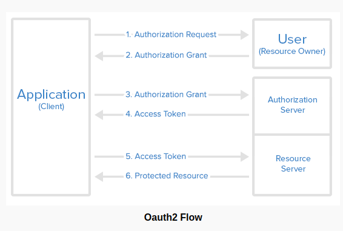

# OAuth2 Authorization and Resource Server - Spring security

Build an **authorization server** to authenticate your identity to provide *access_token*, which you can use to request data from **resource server**.

## 1. Overview

OAuth 2 is an authorization method to provide access to protected resources over the HTTP protocol.	Primarily, oauth2 enables a third-party application to obtain limited access to an HTTP service –

- either on behalf of a resource owner by orchestrating an approval interaction between the resource owner and the HTTP service
- or by allowing the third-party application to obtain access on its own behalf.

### 1.1 Roles

OAuth defines four roles –

- **Resource Owner** – The user of the application.
- **Client** – the application (user is using) which require access to user data on the resource server.
- **Resource Server** – store user’s data and http services which can return user data to authenticated clients.
- **Authorization Server** – responsible for authenticating user’s identity and gives an authorization token. This token is accepted by resource server and validate your identity.

### 1.2 Access Token vs Refresh Token

An **access token** is a string representing an authorization issued to the client. Tokens represent specific scopes and duration of access, granted by the resource owner, and enforced by the resource server and authorization server.

**Refresh token** is issued (along with access token) to the client by the authorization server and is used to obtain a new access token when the current access token becomes invalid or expires, or to obtain additional access tokens with identical or narrower scope (access tokens may have a shorter lifetime and fewer permissions than authorized by the resource owner). Issuing a refresh token is optional at the discretion of the authorization server.

- The responsibility of access token is to access data before it gets expired.
- The responsibility of refresh token is to request for a new access token when the existing access token is expired.

## 2 Oauth2 – Authorization Server
To create authorization server spring security oauth2 module, we need  to use annotation **@EnableAuthorization** and extend the class **AuthorizationServerConfigurerAdapter**.

ref. `OAuth2AuthorizationServer.java`

* Spring security oath exposes two endpoints for checking tokens (`/oauth/check_token` and `/outh/token_key`) which are by default protected behind `denyAll()`. **tokenKeyAccess()** and **checkTokenAccess()** methods open these endpoints for use.

* `ClientDetailsServiceConfigurer` is used to define an in-memory or JDBC implementation of the client details service. we have used in-memory implementation. It has following important attribute:

1. clientId – (required) the client id.

2. secret – (required for trusted clients) the client secret, if any.

3. scope – The scope to which the client is limited. If scope is undefined or empty (the default) the client is not limited by scope.

4. authorizedGrantTypes – Grant types that are authorized for the client to use. Default value is empty.

5. authorities – Authorities that are granted to the client (regular Spring Security authorities).

6. redirectUris – redirects the user-agent to the client’s redirection endpoint. It must be an absolute URL.

## 3. Oauth2 - Resource Server

To create resource server component, use `@EnableResourceServer` annotation and extend the `ResourceServerConfigurerAdapter` class.

ref. `OAuth2ResourceServer.java`

Above config enable protection on all endpoints starting `/api`. All other endpoints can be accessed freely.

The resource server also provide a mechanism to authenticate users themselves. It will be a form based login in most cases.

ref. `SecurityConfig.java`

Above WebSecurityConfigurerAdapter class setup a form based login page and open up the authorization urls with permitAll()

## 4. Oauth2 protected REST resources

For demo purpose, it's been created only one API which returns the logged in user’s name and email.

ref. `RestResource.java`
ref. `UserProfile.java`

### Reference
`https://howtodoinjava.com/spring5/security5/oauth2-auth-server/`
